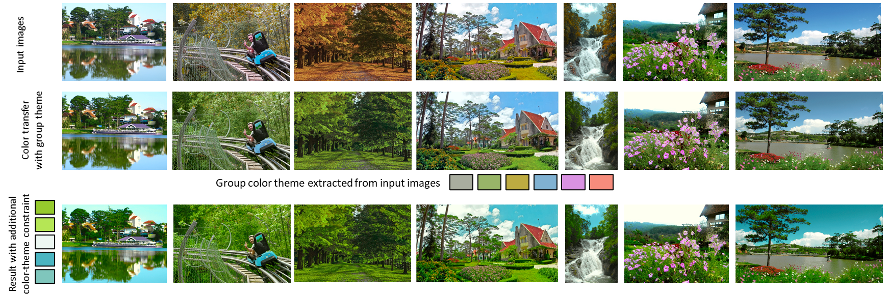
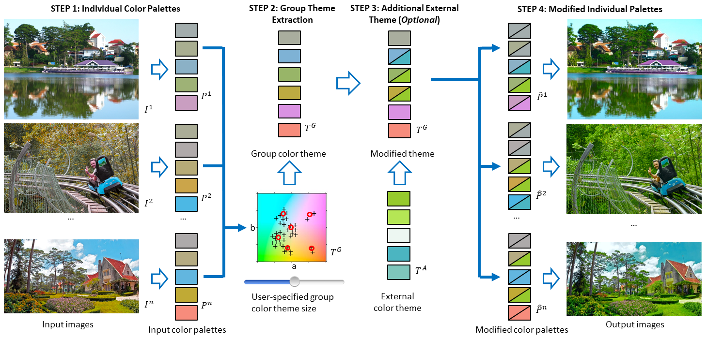

# Group-Theme Recoloring for Multi-Image Color Consistency

This paper has been accpeted by Conference on [Pacific Graphics 2017](http://www.siggraph.org.tw/pg2017/).

[Group-Theme Recoloring for Multi-Image Color Consistency](https://onlinelibrary.wiley.com/doi/abs/10.1111/cgf.13274)

by Rang Nguyen, Brian Price, Scott Cohen, and Michael Brown. 


### Citation
```
@inproceedings{nguyen2017group,
  title={Group-Theme Recoloring for Multi-Image Color Consistency},
  author={Nguyen, Rang MH and Price, Brian and Cohen, Scott and Brown, Michael S},
  booktitle={Computer Graphics Forum},
  volume={36},
  number={7},
  pages={83--92},
  year={2017},
  organization={Wiley Online Library}
}
```


## Contents

- [Introduction](#introduction)
- [Framework](#framework)
- [Usage](#usage)
- [Results](#results)
- [Contacts](#contacts)

## Introduction
Modifying the colors of an image is a fundamental editing task with a wide range of methods available. Manipulating multiple images to share similar colors is more challenging, with limited tools available. Methods such as color transfer are effective in making an image share similar colors with a target image; however, color transfer is not suitable for modifying multiple images. Approaches for color consistency for photo collections give good results when the photo collection contains similar scene content, but are not applicable for general input images. To address these gaps, we propose an application framework for achieving color consistency for multi-image input. Our framework derives a group color theme from the input images’ individual color palettes and uses this group color theme to recolor the image collection. This group-theme recoloring provides an effective way to ensure color consistency among multiple images and naturally lends itself to the inclusion of an additional external color theme. We detail our group-theme recoloring approach and demonstrate its effectiveness on a number of examples.

## Framework

Our group-theme recoloring framework for multiple-images. Step 1: color palettes are extracted for each input image (P_i). Step 2:
a group-theme optimization is used to find the group color theme (T_G). The user can set the group-theme size and optimization parameters.
Step 3 (optional): an additional external color theme (T_A) can be combined with the group color theme. Step 4: the input images are recolored
based on the mappings between T_G, T_A, and P_i. Mappings between color themes and the individual color palettes are denoted by a box with
two triangles, where the top triangle shows the original color and the bottom triangle shows the new color. Note while the overall procedure
is automatic, the user can interactively change the color mappings as needed (results are updated in real time)
## Usage

### 1. Group image recoloring


### 2. Brochure demo


#### Dependencies
- Matlab


## Results


## Contact
If you have any question, please feel free to email me.

Rang Nguyen (rangnhm@gmail.com)
